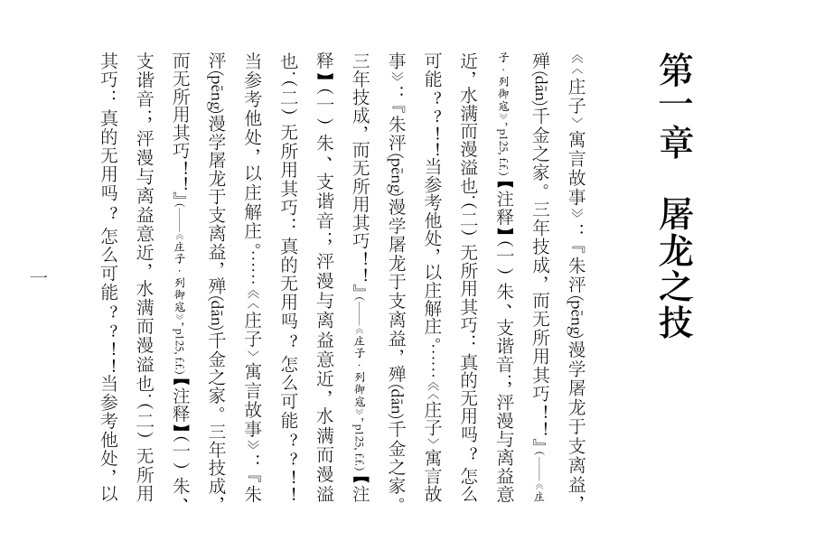

个人学习ConTeXt lmtx 与 LuaTEX，尝试实现中文竖排/直书功能

## 内容

1. 请拷贝[zhfonts](https://github.com/Fusyong/zhfonts)项目与本项目，并排放置两个项目文件夹（`zhfonts` `vertical-typesetting`下）。[zhfonts](https://github.com/Fusyong/zhfonts)是对[liyanrui/zhfonts](https://github.com/liyanrui/zhfonts)项目的改造，以支持直排标点压缩，谨致谢忱！
1. vertical_typeset.lua是直排插件，目前通过vtypesetting_callback.lmtx示例文档来使用
1. vtypesetting_box.lmtx是早期的功能探索示例文档，参见说明[ConTeXt LMTX的汉字竖排思路](htttps://blog.xiiigame.com/2022-01-14-ConTeXt%20LMTX的汉字竖排思路/)

## 运行

仅在[ConTeXt LMTX](https://wiki.contextgarden.net/Installation)环境测试，其他版本的ConTeXt当不支持。ConTeXt LMTX是与LuaMetaTeX(LuaTeX的后继者)配合使用的ConTeXt版本。

使用`context --version && luametatex --version`命令查看你的环境版本。

解释实例文档：

`context vtypesetting_callback.lmtx`

`context vtypesetting_box.lmtx`

如果控制台显示中文时有乱码，可用命令改变代码页：`chcp 65001`

## 现状

<!-- 

 -->

## TODO 

* [ ] 《标点符号用法》 5.2 竖排文稿标点符号的位置和书写形式
    * [x] 5.2.1 句号、问号、叹号、逗号、顿号、分号和冒号均置于相应文字之下偏右。
    * [x] 5.2.2 破折号、省略号、连接号、间隔号和分隔号置于相应文字之下居中,上下方向排列。
    * [x] 5.2.3 引号改用双引号“﹃ ”“﹄ ”和单引号“﹁ ”“﹂ ”,括号改用“︵ ”“︶ ”,标在相应项目的上下。
    * [ ] 5.2.4 竖排文稿中使用浪线式书名号“﹏”,标在相应文字的左侧。
    * [ ] 5.2.5 着重号标在相应文字的右侧,专名号标在相应文字的左侧。
    * [ ] 5.2.6 横排文稿中关于某些标点不能居行首或行末的要求,同样适用于竖排文稿。
* [x] 字右、字左注音
* [ ] 横排标点转竖排标点
* [ ] 更改旋转对齐规则（解决“一、灬”等字的问题）
* [ ] 删除破折号、省略号紧止排在行头的规则
* [ ] 夹注/割注
* [ ] ……

<!-- 
## 参考资料

### [《挤进推出避头尾》](https://www.thetype.com/2018/05/14501/)所述的避头尾规则：

> * 点号，包括句号、问号、叹号、逗号、顿号、分号、冒号，都要避头。
> * 标号中的引号、括号、书名号：前一半避尾，后一半避头。
> * 标号中的连接号（–）、间隔号（·）都不能出现在行头。
> * 标号中的分隔号（/）不能出现在行头也不出现在行尾。

### 无需旋转的竖排标点

︵ ︷ ︿ ︹ ︽ _ ﹁ ﹃ ︻ ︶ ︸ ﹀ ︺ ︾ ˉ ﹂ ﹄ ︼

-->
